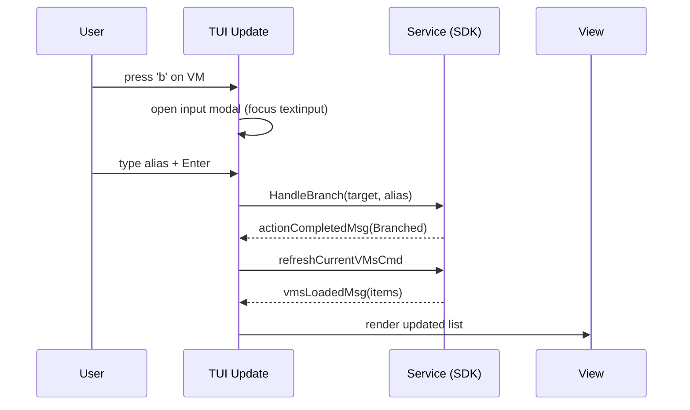

# Architecture

Project structure
- cmd/: Cobra commands and CLI entrypoint (`cmd/vers`).
- internal/:
  - app/: app wiring and configuration.
  - handlers/: orchestrate requests (pause, resume, branch, commit, rename...).
  - services/: thin API clients by domain (status, tree, history, deletion, vm).
  - presenters/: print user-facing results for CLI commands.
  - tui/: Bubble Tea TUI (`model.go`, `update.go`, `view.go`, `keys.go`).
  - ssh/: helpers for running system ssh via ExecProcess.
  - utils/: helpers (network, resolution, key paths).
- styles/: adaptive color and text styles for CLI/TUI.
- test/: integration tests that exercise CLI via `os/exec`.

Key flows
- CLI Command → Handler → Service (SDK) → Presenter.
- TUI Input → Update → tea.Cmd → Service → tea.Msg → Update → View.

TUI state
- Focus: clusters | vms | modal.
- Modal kinds: input, confirm, text.
- Background refresh (3s tick) with fingerprint diffing and selection preservation.
- Debounced VM loads when cluster selection changes.

