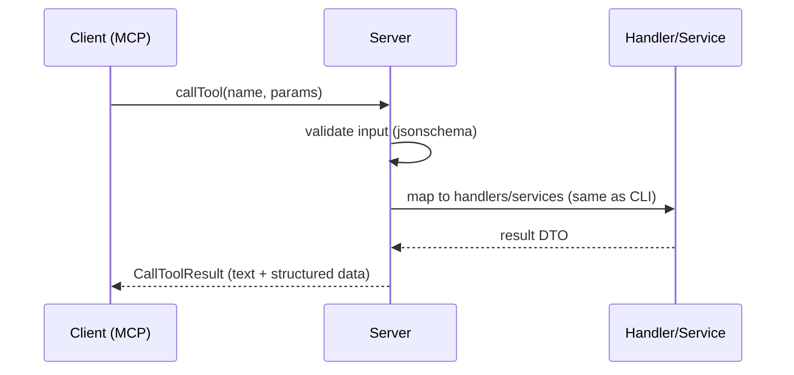

# MCP (Model Context Protocol)

This codebase exposes an MCP server (when built with `-tags mcp`) so AI tooling can call Vers operations as tools.

What’s implemented
- Transport: stdio by default; HTTP scaffolding in place.
- Tools (selected):
  - `vers.status`, `vers.run`, `vers.execute`, `vers.branch`, `vers.kill`, `vers.version`, `vers.metrics`, `vers.capabilities`.
- Validation & schemas: Typed inputs with `jsonschema` annotations in `internal/mcp/types.go`, validated by `validate.go`.
- Metrics & rate limits: per-tool counters and simple per-minute limits (see `metrics.go`), reported via `vers.metrics`.

Server wiring
- Entry: `internal/mcp/server_mcp.go` → `StartServer(ctx, app, opts)`.
- Registration: `adapters.go` wires tools by calling `register*Tool` helpers.
- Transport: `startStdio` integrates with the Go MCP SDK for stdio.

Call flow (typed tools)

Running
- Build with MCP tag and run as a stdio server:
  - `go build -tags mcp -o bin/vers-mcp ./cmd/vers`
  - Configure your MCP client (e.g., Claude Desktop) to launch the binary in stdio mode.
- Environment:
  - Uses the same `VERS_URL` and `VERS_API_KEY` as the CLI; can also read from `vers.toml`.

Tool mapping
- Each tool wraps the corresponding handler (e.g., `vers.branch` → `internal/handlers/branch.go`).
- Inputs mirror CLI flags; outputs return a short text summary and a typed view for programmatic use.

Safety
- Destructive ops (`kill`) require explicit flags in the tool input (e.g., `skipConfirmation: true`) and may enforce rate limits.

Extending
- Add a new input struct in `types.go` with `jsonschema` tags.
- Implement `registerXTool` similar to existing ones and add it in `adapters.go`.
- Include your tool in `capabilities.go` (tracked automatically via `trackTool`).

