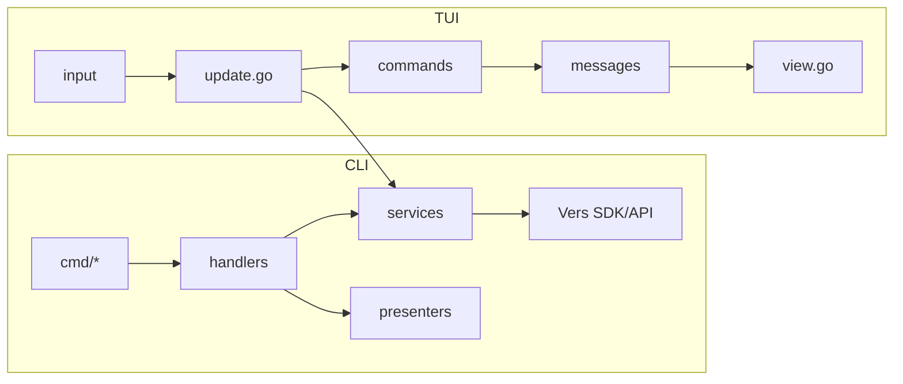

# Overview

Vers CLI is a developer-facing tool for managing clusters and VMs with a Git-like workflow: branch, run, commit, pause/resume, and connect. It offers both:
- A scriptable CLI (Cobra-based).
- An interactive TUI (Bubble Tea) for keyboard-driven operations.

High-level components
- CLI commands (`cmd/vers`): Parse flags/args, call handlers.
- App/Handlers (`internal/app`, `internal/handlers`): Orchestrate behavior, validate inputs, shape requests.
- Services (`internal/services/**`): Thin wrappers around the Vers Go SDK (HTTP API).
- Presenters (`internal/presenters/**`): User-facing output formatting for CLI flows.
- TUI (`internal/tui`): Bubble Tea MVU app for browsing clusters/VMs and taking actions.
- Styles (`styles/**`): Adaptive colors/themes shared across outputs.

Data flow (CLI)
1) Cobra command parses args/flags.
2) Handler builds request (may resolve IDs/aliases), calls the SDK via a Service.
3) Presenter prints concise, styled output.

Data flow (TUI)
1) Bubble Tea Model/Update/View: user input → Update → Commands → Messages → View.
2) Service calls return messages; lists refresh with diffing and selection preservation.
3) Long-running ops emit status toasts; SSH uses ExecProcess to hand off the terminal.

