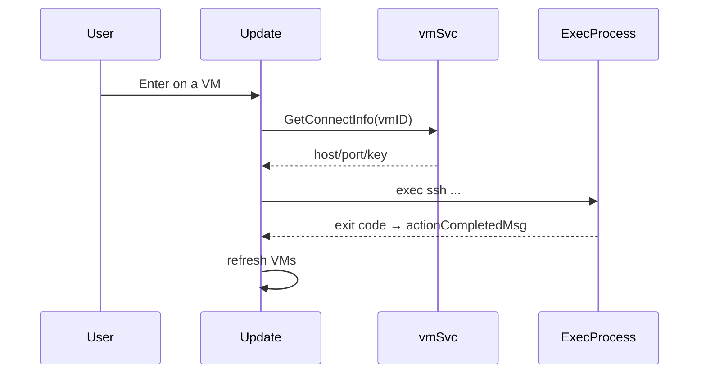

# TUI

Files
- `internal/tui/model.go` — state, commands, helper selection.
- `internal/tui/update.go` — input handling, side effects, timers.
- `internal/tui/view.go` — layout and rendering.
- `internal/tui/keys.go` — keymap and help bindings.
- `internal/tui/delegate.go` — single-line VM list renderer with colored state.

Layout
- Two-pane layout: Clusters (sidebar) and VMs.
- Sidebar can be toggled with `s`; focus moves to VMs on collapse.
- Focus-resize: sidebar shrinks when VM pane has focus.

Keymap (selected)
- Enter: SSH connect (releases terminal via ExecProcess).
- b: Branch (input modal for alias).
- c: Commit (input modal for tags).
- a: Rename (input modal; duplicate alias prompts confirmation).
- k: Delete (confirm; toggle recursive with R).
- p/r: Pause/Resume.
- h/t: History/Tree (text modal).
- tab: Switch panel.
- s: Toggle sidebar.
- q: Quit.

Modals
- Input: captures keys before list handlers; Esc cancels; Enter submits.
- Confirm: y/Enter confirm, n/Esc cancel; supports dynamic prompts (e.g., recursive toggle).
- Text: Esc/q to close.

Performance
- Background refresh every 3s (quiet) with fingerprint diffing to avoid redraws.
- Debounced VM loads (120ms) when cluster selection changes.
- Spinner only animates while loading.

Theming
- Uses `styles` adaptive palette for borders, muted text, and state colors.
- Selected row is bold; non-selected rows are dimmed.

Flow: SSH connect

